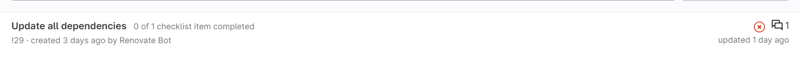
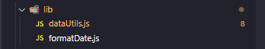
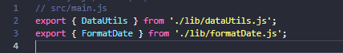
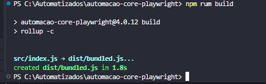
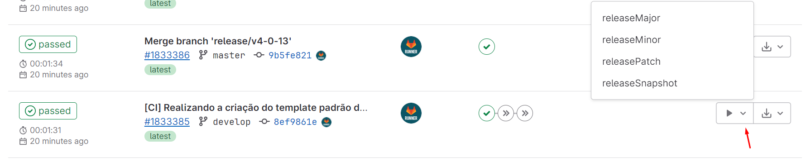
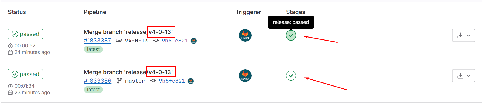

# Documentação do Projeto Core Playwright

## Instalação e Utilização

### Instalando a Versão Mais Recente da Biblioteca

Para instalar a versão mais recente da biblioteca, use o comando:

```bash
npm install automacao-core-playwright@latest
```

### Utilização

Após a instalação, você pode importar e usar a biblioteca no seu projeto:

```bash
import { DataUtils, FormatDate } from 'automacao-core-playwright';

export class NomeDaClassPage {
  constructor(page) {
    this.page = page;
    this.dataUtils = new DataUtils(page);
    this.formatDate = new FormatDate(page);
  }
  async nomeDaFuncao() {
      await this.dataUtils.navegarParaPagina('Gestão de Pessoas | HCM', 'Painel de gestão', 'Solicitações');
      await this.formatDate.pegaDataAtualComBarrasMesDiaAno();
}
```
### Atualização

É recomendado que, antes de criar uma nova função que possa ser usada em todo o projeto, valide se não existe uma versão mais recente que já possua a função criada.

Para validar se há uma versão mais recente disponível, é possível verificar nos Merge Requests do seu projeto.




## Adição de Funções

O arquivo para adição de novas funções está localizado na pasta src/lib.

  - Pastas: Devem seguir o padrão kebab-case.

      Exemplo: nome-da-pasta.

  - Arquivos: Devem seguir o padrão CamelCase.

      Exemplo: nomeDoArquivo.js.

Para criar uma nova função, utilize o mesmo formato de uma page do projeto Playwright:

```bash
  async nomeDaFuncao() {
    await comandos_aqui
  }
```

Caso crie um novo arquivo .js, ele deve ter ser exportado no arquivo src/index.d.ts para que seja incluído no processo de build.





Após finalizar a função, execute o comando:

```bash
npm rum build
```



O arquivo não deve apresentar nenhum erro.

Depois de rodar o build, o projeto pode ser comitado normalmente.

Assim que comitado, abra um Merge Request (MR) como de costume.

## Nova versão
Após a aprovação do MR, vá para as Pipelines:

"https://git.senior.com.br/automacao-testes/automacao-core-playwright/-/pipelines"

Nela, você terá a opção de gerar uma nova versão.

Escolha entre:

releaseMajor (MAJOR): quando fizer mudanças incompatíveis na API.

releaseMinor (MINOR): quando adicionar funcionalidades mantendo compatibilidade

releasePatch (PATCH): quando corrigir falhas mantendo compatibilidade.


Assim que a release passar a nova versão ja estará pronta para ser usada.


Para usar a nova versão no seu projeto Playwright, utilize os comandos:

```bash
npm uninstall automacao-core-playwright
npm install automacao-core-playwright@latest
```

Assim, a biblioteca estará atualizada no seu projeto Playwright.
