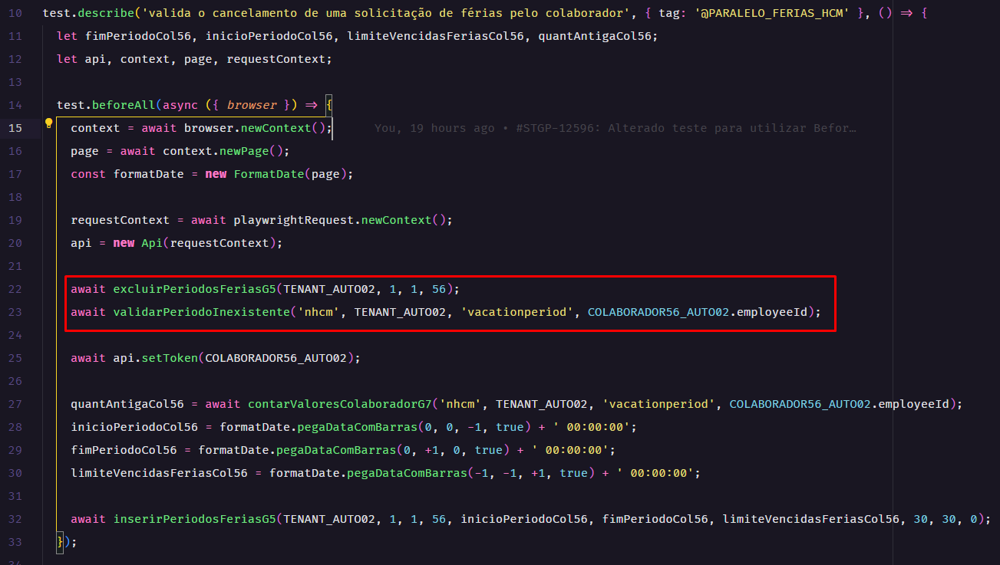

# Padronização de código

---

## Criação de locators

---

  Os locators são usados para encontrar elementos na página da web para interagir durante os testes. Aqui estão algumas diretrizes para criar locators.

---

### Nomenclatura de locators

  A nomenclatura dos locators deve seguir o padrão de lowerCamelCase.

  Você deve começar com **locator**, depois pode especificar sobre o elemento que está sendo localizado, como **DocumentoVisitante**, e ao final adicionar o tipo de campo esperado, como um input, um button, um link, etc.

  Por exemplo:

  ```javascript
  let locatorConfirmarSelecaoMotoristaButton = this.frame.locator('#modal-selecao-motorista').getByRole('button', { name: 'Confirmar' });
  let locatorMensagemOperadorVinculadoInput = this.frame.getByText('Operador vinculado com sucesso');
  let locatorDocumentoVisitanteInput = frame.getByPlaceholder('Insira o número do documento');
  ```

  No exemplo acima, **locatorConfirmarSelecaoMotoristaButton** é uma variável que localiza um botão, **locatorMensagemOperadorVinculadoInput** localiza um campo de input de texto, e **locatorDocumentoVisitanteInput** localiza um campo de input de texto para o documento do visitante.

---

### Seleção de Elementos

  Ao selecionar elementos, é preferível usar métodos que sejam menos propensos a mudanças. Por exemplo, é melhor usar IDs, nomes de classes ou atributos `data-*` em vez de estruturas de árvore complexas que podem mudar com o tempo.

---

### Evite usar XPath

  Embora o XPath possa ser poderoso, ele também pode ser mais difícil de ler e manter do que outros seletores. Além disso, o XPath pode ser mais lento para renderizar no navegador. Portanto, é melhor evitar o uso de XPath sempre que possível.

---

### Teste seus Locators

  Certifique-se de testar seus locators para garantir que eles estão selecionando os elementos corretos.

---

### Exemplo de escrita nos arquivos pages e .spec

  Exemplo de escrita de **Pages**

  ```javascript
  export class PlanejarPage {
    constructor(page) {
      this.page = page;
      this.dataUtils = new DataUtils(page);
      this.frame = this.page.frameLocator('iframe[name="ci"]');
      this.locatorConfirmarRoteirizacaoButton = this.frame.locator('#itinerarios').getByRole('button', { name: 'Confirmar' });
      this.locatorContinuarRoteirizacaoButton = this.frame.getByRole('button', { name: 'Sim' });
    }

    /** informa os campos da aba 'roteirizar' e realiza a roteirização de um planejamento
   * @param {string} motorista Nome do motorista que será selecionado na roteirização
    */
    async preencherAbaRoteirizar(motorista){
      await this.frame.getByRole('row', { name: motorista }).getByRole('gridcell').locator('span').click();
      await this.locatorConfirmarRoteirizacaoButton.click();
      await this.locatorContinuarRoteirizacaoButton.click();
    }
  }
  ```

  Exemplo de escrita nos arquivos de testes, **.spec**

  ```javascript
  let locatorDocumentoVisitanteInput;

  test.describe('recepção', { tag: ['@GESTAOPORTARIAS',  '@RECEPCAO']}, () => {
    test.beforeEach(async ({ page }) => {
      console.log(`Executando teste: ${test.info().title}`);
      await page.dataUtils.login(COLABORADOR21_AUTO04);
      await page.dataUtils.navegarParaPagina('Gestão de Acesso e Segurança | Ronda X', 'Gestão de portarias', 'Recepção');

      locatorDocumentoVisitanteInput = frame.getByPlaceholder('Insira o número do documento');
    })

    test('001 - Recepção - Cadastrar nova pessoa com nome existente e apertar em "Cadastrar nova pessoa" os campos estão em branco', {
      tag: '@RECEPCAO-02',
      annotation: {
        type: 'QEPM',
        description: 'https://jira.senior.com.br/browse/MNTSAM-679'
      }
     }, async ({ page }) => {
      await page.recepcaoPage.selecionarTipoVisita(JSON_DADOSVISITANTERECEPCAO.tipoVisita);
      await locatorDocumentoVisitanteInput.click();
      await page.recepcaoPage.validarCamposVaziosCadastroVisitante();
    });
  })
  ```

---

## TAGs

---

  As TAGs são usadas para categorizar e organizar os testes. Aqui estão algumas diretrizes para criar e usar TAGs.

---

### Nomenclatura de Tags

  A nomenclatura das TAGs deve ser clara e descritiva. Elas devem indicar claramente o propósito ou a funcionalidade do teste que estão marcando.

  Por exemplo, uma TAG como **@MINHA_TAG_AUTENTICACAO_USUARIO** poderia ser usada para marcar todos os testes relacionados à autenticação do usuário.

---

### Uso

  As TAGs devem ser usadas de maneira consistente em todos os testes. Se você começar a usar uma TAG para marcar um certo tipo de funcionalidade, continue a usá-la de maneira consistente.

  Por exemplo, se você usar a TAG **@MINHA_TAG_ACESSO_BANCO_DADOS** para marcar testes que verificam o acesso ao banco de dados, use-a sempre que estiver criando ou modificando testes que verificam o acesso ao banco de dados.

  No **test.describe**: Aqui, a tag é aplicada a todos os testes dentro desse bloco describe. Isso significa que todos os testes dentro desse bloco serão marcados com essa tag. Por exemplo:

  ```javascript
  test.describe('validar o fluxo de solicitação coletiva de férias', { tag: '@MINHA_TAG_AUTENTICACAO_USUARIO' }, () => {
  // Todos os testes aqui dentro terão a tag '@PARALELO_FERIAS_HCM'
  });
  ```

  No **test()**: Aqui, a tag é aplicada apenas a esse teste específico. Isso significa que apenas este teste será marcado com essa tag. Por exemplo:

  ```javascript
  test('001 - Gestor Solicita férias coletiva e valida integração dos períodos de férias da G5 para G7.', {
    tag: '@MINHA_TAG_ACESSO_BANCO_DADOS',
    // Este teste terá a tag '@MINHA_TAG_ACESSO_BANCO_DADOS' mas tbm pode ser executado pela TAG do describe
  }, async ({ request, page }) => {
    // Código do teste
  });
  ```

---

### Teste suas TAGs

  Certifique-se de que suas TAGs estão sendo aplicadas corretamente. Você pode fazer isso verificando se os testes marcados com uma determinada TAG realmente se relacionam com o que a TAG indica.

---

## JSdoc

---

  O JSDoc é uma ferramenta de documentação para JavaScript. Usar JSDoc com suas funções ajuda a esclarecer o que a função faz, quais parâmetros ela aceita e o que ela retorna. Aqui estão algumas diretrizes para usar o JSDoc em suas funções.

  Ao criar uma função, você deve criar um JSDoc para ela. O JSDoc deve explicar o propósito da função. Se a função aceita parâmetros, esses parâmetros devem ser documentados no JSDoc. Para cada parâmetro, você deve indicar o nome do parâmetro, seu tipo (por exemplo, String, Object, etc.) e uma descrição do que o parâmetro representa. Os parâmetros devem ser listados na mesma ordem em que aparecem na lista de parâmetros da função.

  Se um parâmetro é um objeto, a estrutura do objeto deve ser especificada. Existem duas maneiras de fazer isso: você pode referenciar um objeto JSON definido em outro lugar (por exemplo, em um arquivo na pasta DATA), ou você pode descrever a estrutura do objeto diretamente no JSDoc. Se possível, prefira referenciar um objeto JSON definido em outro lugar, pois isso mantém o JSDoc mais limpo e mais fácil de ler.

  Aqui está um exemplo de como documentar uma função com JSDoc:

  ```javascript
  /**
   * Solicita férias individuais para um colaborador.
   * @param {string} employeeId - ID do colaborador que solicita as férias.
   * @param {Object} reqBody - Objeto JSON com informações para a solicitação de férias.
   * exemplo: JSON_INSERIRFERIAS
   */
  async inserirFeriasColaborador(employeeId, reqBody) {}
  ```

---

## Nomenclaturas

---

Nomenclaturas consistentes são cruciais para a manutenção e compreensão do código. Aqui estão algumas diretrizes para nomear diferentes elementos do projeto.

---

## Pages

As pages criadas sempre devem finalizar com o nome page, exemplo **FeriasPage**


---

### Pastas

  As pastas devem seguir o padrão de lowerCamelCase. Isso significa que a primeira palavra deve estar em minúsculas e cada palavra subsequente deve começar com uma letra maiúscula. Por exemplo: **painelGestao**.

  

---

### Arquivos

  A nomenclatura dos arquivos deve seguir o mesmo padrão de lowerCamelCase. Por exemplo: **colaboradorSolicitaFeriasParceladasPage**.

  O final do nome do arquivo, sempre tem que condizer com a pasta que ele está localizado, se estiver dentro conforme exemplo:

* Pasta /***api*** o arquivo deverá se chamar batatinha***Api***.js
* Pasta /***data*** o arquivo deverá se chamar batatinha***Json***.js
* Pasta /***db*** o arquivo deverá se chamar batatinha***Db***.js
* Pasta /***pages*** o arquivo deverá se chamar batatinha***Page***.js
* Pasta /***tests*** o arquivo deverá se chamar batatinha.***spec***.js

  

---

## Funções

* Evitar de deixar **linhas em branco**. (Se faz sentido separar pela lógica, não seria melhor dividir em mais de uma função? Funções pequenas e específicas são mais fáceis de escrever e manter).
* Criar funções **legíveis**.
* Usar o bom senso na utilização de logs, colocar **apenas em pontos cruciais**. Pensar sempre no clean code.
* Cuidado com o **excesso de comentários**, podemos usar mas com moderação, pois eles tendem a sujar o script e ficar desatualizados com o tempo.
* Nomes dos métodos **claros e autoexplicativos**.
* Coloque sempre a **ação que o método faz, no início do seu nome**. Por exemplo, ao invés de criar um método chamado pessoa, deve ser incluirPessoa.
* Devem ser criados no padrão **camelCase**.

---

## Limpeza de base

* Em algumas situações se faz necessário a exclusão dos dados que foram inseridos durante o teste, pois caso esses registros não sejam deletados, isso acarretará impactos negativos em outros testes. Por exemplo, se o teste cadastra um inventário sempre com o mesmo código, é necessário excluir esse inventário para que na próxima execução não ocorra erro ao cadastrar o mesmo código no banco de dados.
* É comum nesses casos que a limpeza seja feita no "After" do teste, ou em um cenário no final da classe, porém **recomendamos fortemente que essa limpeza seja feita no "Before" do teste, ou até mesmo em um cenário no início da classe**, pois dessa forma caso o teste seja abortado durante a sua execução a limpeza da base não será feita. Quando executada no início do teste, mesmo que abortado a limpeza irá acontecer e não teremos problema na nova inserção. Lembrando que nesses casos pode ser necessário a recuperação dos registros a serem excluídos através de chamadas auxiliares ou consultas no banco de dados.

  
